# System Architecture Diagram

## High-Level Architecture

## Detailed Component Architecture

```mermaid
graph LR
    subgraph "User Interfaces"
        UI1[Web App<br/>MapLibre GL JS<br/>Real-time Updates]
        UI2[Admin Panel<br/>Booking Management<br/>Analytics]
        UI3[Mobile PWA<br/>GPS Tracking<br/>Push Notifications]
    end
    
    subgraph "Backend Services"
        API[Express API Server]
        WS[WebSocket Handler<br/>Socket.io]
        AUTH[Authentication<br/>Middleware]
    end
    
    subgraph "Core Services"
        BOOK[Booking Service<br/>Conflict Prevention]
        LOC[Location Service<br/>Geocoding]
        NOTIF[Notification Service<br/>FCM Integration]
        PARKING[Parking Spot Service<br/>Availability Management]
    end
    
    subgraph "AI Services"
        NLP[Natural Language<br/>Processing]
        WORKFLOW[LangGraph Workflow<br/>Query → Filters]
        PARSER[Intent Parser<br/>Entity Extraction]
    end
    
    subgraph "Data Layer"
        DB[(Firebase Firestore<br/>or In-Memory)]
        CACHE[(Redis Cache<br/>Future)]
    end
    
    UI1 --> API
    UI2 --> API
    UI3 --> API
    
    API --> AUTH
    API --> WS
    API --> BOOK
    API --> LOC
    API --> NOTIF
    API --> PARKING
    
    BOOK --> DB
    LOC --> DB
    NOTIF --> DB
    PARKING --> DB
    
    API --> NLP
    NLP --> WORKFLOW
    WORKFLOW --> PARSER
```

## AI Integration Flow

## MCP (Model Context Protocol) Integration

## Data Flow Architecture

## Technology Stack Layers

## Deployment Architecture

