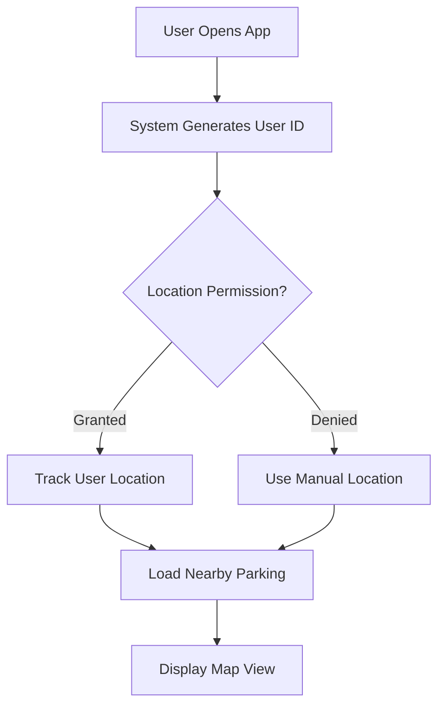

# 🚗 Parking Space Solution - Complete User Flow Guide

## Table of Contents
1. [Overview](#overview)
2. [User Journey Map](#user-journey-map)
3. [Detailed User Flows](#detailed-user-flows)
4. [Navigation Integration](#navigation-integration)
5. [Key Features](#key-features)
6. [User Experience Analysis](#user-experience-analysis)

---

## Overview

This parking solution provides a comprehensive platform for finding, booking, and navigating to parking spots. The system combines real-time availability, voice assistance, and booking management to create a seamless parking experience.

## User Journey Map

```
┌─────────────────────────────────────────────────────────────────┐
│                     USER PARKING JOURNEY                         │
├─────────────────────────────────────────────────────────────────┤
│                                                                   │
│  1. DISCOVERY           2. SELECTION         3. BOOKING          │
│  ┌──────────┐          ┌──────────┐         ┌──────────┐       │
│  │ Open App │ ───────> │  Browse  │ ──────> │  Reserve │       │
│  │  Login   │          │   Spots  │         │   Spot   │       │
│  └──────────┘          └──────────┘         └──────────┘       │
│       │                      │                     │             │
│       ▼                      ▼                     ▼             │
│  ┌──────────┐          ┌──────────┐         ┌──────────┐       │
│  │   Get    │          │  Filter  │         │  Confirm │       │
│  │ Location │          │ Options  │         │  Details │       │
│  └──────────┘          └──────────┘         └──────────┘       │
│                                                    │             │
│                                                    ▼             │
│  4. NAVIGATION         5. ARRIVAL          6. MANAGEMENT        │
│  ┌──────────┐         ┌──────────┐        ┌──────────┐        │
│  │Navigate  │ ──────> │  Park    │ ─────> │  Track   │        │
│  │to Spot   │         │  Vehicle │        │ Booking  │        │
│  └──────────┘         └──────────┘        └──────────┘        │
│                                                                  │
└─────────────────────────────────────────────────────────────────┘
```

## Detailed User Flows

### 1. Initial Setup Flow



**Steps:**
1. User launches the web application
2. System automatically generates unique user ID (`user-{timestamp}`)
3. Browser requests location permission
4. LocationTracker component begins monitoring position
5. Default 500m search radius activated
6. Parking spots load on map

### 2. Finding Parking Spots

#### Visual Search Flow
```
User Action                System Response
───────────                ───────────────
View Map         ────>     Display parking markers
                          
Adjust Radius    ────>     Refresh spots (100m-5km)
                          
Click on Map     ────>     Set custom search center
                          
View Statistics  ────>     Show availability panel
```

#### Voice Search Flow
```
User Action                System Response
───────────                ───────────────
Click Voice Icon ────>     Expand assistant
                          
Speak Command    ────>     Process with NLP
                          
"Find parking"   ────>     Search & respond
                          
Select Result    ────>     Highlight on map
```

**Voice Commands Supported:**
- "Find parking near me"
- "Show me cheap parking spots"
- "Find parking with EV charging"
- "I need covered parking"
- "Find parking near [landmark]"

### 3. Booking Flow

```
┌─────────────────────────────────────────┐
│           BOOKING PROCESS               │
├─────────────────────────────────────────┤
│                                          │
│  1. SELECT SPOT                          │
│     ├─ Click marker on map               │
│     └─ Spot details appear               │
│                                          │
│  2. CONFIGURE BOOKING                    │
│     ├─ Select date (default: today)      │
│     ├─ Choose arrival time:              │
│     │   • In 10 minutes                  │
│     │   • In 30 minutes                  │
│     │   • In 1 hour                      │
│     │   • In 2 hours                     │
│     │   • Specific time                  │
│     └─ Set duration (30min - 3hrs)       │
│                                          │
│  3. CONFIRM RESERVATION                  │
│     ├─ Review details                    │
│     ├─ Check availability                │
│     └─ Submit booking                    │
│                                          │
│  4. RECEIVE CONFIRMATION                 │
│     ├─ Booking ID generated              │
│     ├─ Real-time notification            │
│     └─ Active booking displayed          │
│                                          │
└─────────────────────────────────────────┘
```

### 4. Navigation Flow (Proposed Enhancement)

```
┌─────────────────────────────────────────┐
│         NAVIGATION INTEGRATION          │
├─────────────────────────────────────────┤
│                                          │
│  PHASE 1: GENERAL NAVIGATION            │
│  ┌────────────────────────────┐         │
│  │ [Navigate] button in booking│         │
│  │            ↓                │         │
│  │  Opens Google/Apple Maps    │         │
│  │            ↓                │         │
│  │  Route to entrance coords   │         │
│  └────────────────────────────┘         │
│                                          │
│  PHASE 2: ARRIVAL GUIDANCE              │
│  ┌────────────────────────────┐         │
│  │  Approaching destination    │         │
│  │            ↓                │         │
│  │  Show entrance photo        │         │
│  │            ↓                │         │
│  │  Display parking level/spot │         │
│  │            ↓                │         │
│  │  Confirm arrival            │         │
│  └────────────────────────────┘         │
│                                          │
│  PHASE 3: INDOOR NAVIGATION             │
│  ┌────────────────────────────┐         │
│  │  Enter parking structure    │         │
│  │            ↓                │         │
│  │  Level-by-level guidance    │         │
│  │            ↓                │         │
│  │  Spot-specific directions   │         │
│  │            ↓                │         │
│  │  AR overlay (optional)      │         │
│  └────────────────────────────┘         │
│                                          │
└─────────────────────────────────────────┘
```

### 5. Booking Management Flow

```
User Actions              System Features
────────────              ───────────────
View Bookings    ───>     Display all reservations
                         Status indicators:
                         • 🟢 Active/Confirmed
                         • 🟡 Pending
                         • 🔴 Cancelled
                         • ⚫ Completed

Cancel Booking   ───>     Confirmation prompt
                         Update status
                         Send notification

Refresh List     ───>     Fetch latest data
                         Update display
```

## Navigation Integration

### Current State
- ❌ No built-in navigation
- ❌ No entrance guidance
- ❌ No indoor directions

### Proposed Implementation

#### Quick Win (Phase 1)
```javascript
// Add to BookingPanel.js
const handleNavigate = () => {
  const { latitude, longitude } = spot.entrance || spot;
  const url = `https://www.google.com/maps/dir/?api=1&destination=${latitude},${longitude}`;
  window.open(url, '_blank');
};
```

#### Enhanced Guidance (Phase 2)
```javascript
// New component: ParkingGuidance.js
const ParkingGuidance = ({ spot, booking }) => {
  return (
    <div className="parking-guidance">
      
      <div className="instructions">
        <h3>Parking Instructions</h3>
        <ul>
          <li>Enter via {spot.entranceName}</li>
          <li>Proceed to Level {spot.level}</li>
          <li>Find spot {spot.spotNumber} in Section {spot.section}</li>
        </ul>
      </div>
      <button onClick={startIndoorNav}>
        Start Indoor Navigation
      </button>
    </div>
  );
};
```

## Key Features

### 🎯 Core Functionality
| Feature | Description | Status |
|---------|-------------|--------|
| Real-time Map | Interactive map with parking markers | ✅ Implemented |
| Spot Search | Radius-based and custom center search | ✅ Implemented |
| Voice Assistant | Natural language parking search | ✅ Implemented |
| Booking System | Time-based reservations | ✅ Implemented |
| Booking Management | View/cancel bookings | ✅ Implemented |
| Navigation | Turn-by-turn directions | ❌ Not Implemented |
| Payment | In-app payment processing | ❌ Not Implemented |

### 🔔 Real-time Features
- WebSocket notifications for booking updates
- Live availability status (when data available)
- Dynamic pricing updates
- Approaching booking time alerts

### 🎨 User Interface
- Draggable panels for flexible layout
- Minimizable components
- Responsive design for mobile/desktop
- Voice interaction support
- Visual and audio feedback

## User Experience Analysis

### Strengths ✅
1. **Multiple Interaction Methods**
   - Visual (map)
   - Voice (assistant)
   - Traditional (forms)

2. **Intuitive Time Selection**
   - Relative times ("in 10 minutes")
   - Reduces cognitive load

3. **Real-time Updates**
   - WebSocket for live notifications
   - Status changes reflected immediately

4. **Flexible Search**
   - Location-based
   - Custom center points
   - Adjustable radius

### Areas for Improvement ⚠️

1. **Navigation Gap**
   - **Problem**: Users can find but not reach spots
   - **Solution**: Integrate navigation (Phase 1-3 approach)

2. **Data Reliability**
   - **Problem**: Depends on incomplete OSM data
   - **Solution**: Partner with parking operators

3. **Payment Integration**
   - **Problem**: Booking without payment
   - **Solution**: Add payment gateway

4. **Enforcement**
   - **Problem**: No guarantee spot remains available
   - **Solution**: QR codes or barrier systems

### User Satisfaction Metrics

```
┌────────────────────────────────────┐
│     Expected User Satisfaction     │
├────────────────────────────────────┤
│                                    │
│ Finding Spots:     ████████░░ 80% │
│ Booking Process:   █████████░ 90% │
│ Navigation:        ███░░░░░░░ 30% │
│ Arrival:           ████░░░░░░ 40% │
│ Management:        ████████░░ 80% │
│                                    │
│ Overall:           ██████░░░░ 64% │
│                                    │
│ With Navigation:   ████████░░ 85% │
└────────────────────────────────────┘
```

## Recommendations

### Immediate Improvements
1. **Add Navigation Button** - Quick integration with Google Maps
2. **Include Entrance Photos** - Help users identify locations
3. **Add Spot Instructions** - Text directions for complex locations

### Medium-term Enhancements
1. **Payment Integration** - Complete the booking flow
2. **User Reviews** - Build trust and provide insights
3. **Favorite Spots** - Quick rebooking for regular users

### Long-term Vision
1. **Partner with Operators** - Real availability data
2. **Indoor Positioning** - Bluetooth beacons for garages
3. **Predictive Availability** - ML-based forecasting
4. **Multi-modal Transport** - Integration with public transit

## Conclusion

The current parking solution provides a solid foundation with good UX for discovery and booking. The critical missing piece is navigation, which would transform it from a "parking finder" to a complete "parking solution." With the proposed navigation integration and other enhancements, user satisfaction could increase from 64% to 85%+.

### Next Steps
1. Implement Phase 1 navigation (external app integration)
2. Add entrance photos and instructions to spot data
3. Create partnerships for real-time availability
4. Integrate payment processing
5. Develop indoor navigation for complex structures

---

*This user flow guide demonstrates how the parking solution works and identifies key areas for improvement to create a truly helpful parking experience.*
